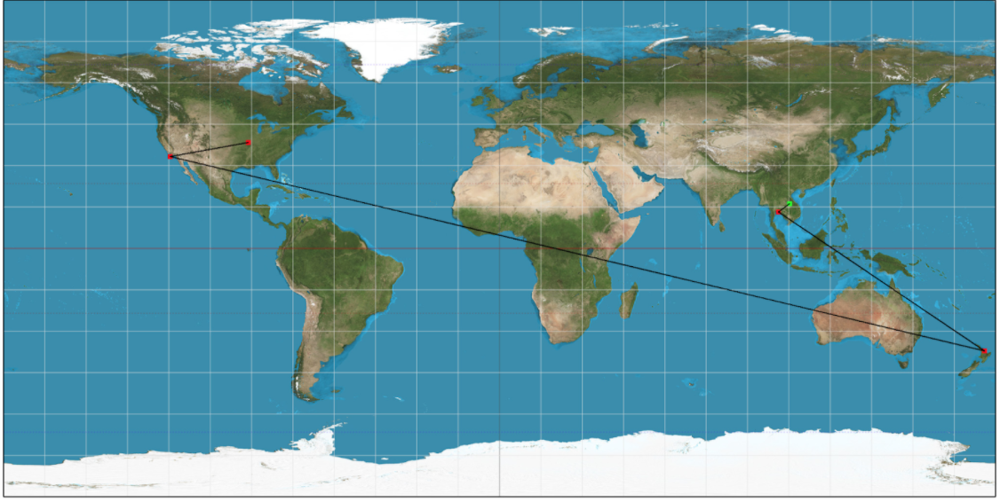
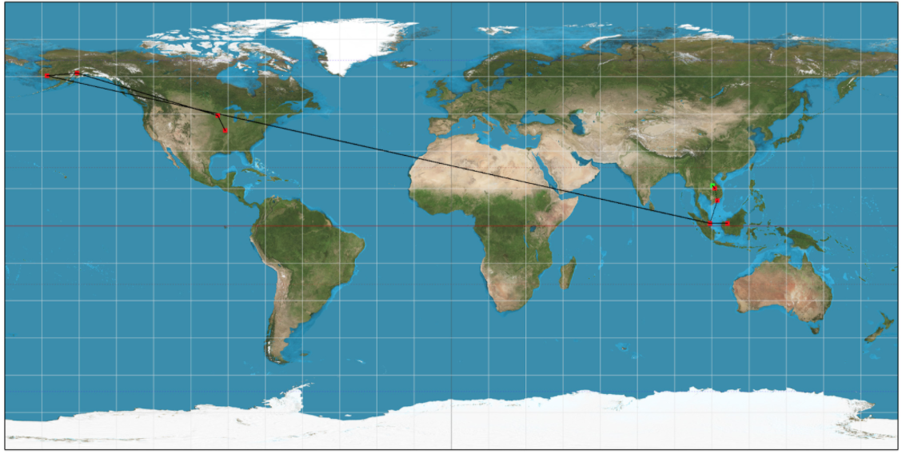

Our project is a program by which the most efficient route between two airports can be calculated. Efficiency can be determined by two separate metrics: fewest airports traveled between destinations as well as minimal fuel consumption (calculated via total kilometers traveled).

Using travel routes data as well as airport data, a graph was constructed wherein each node was an airport, and each edge was a travel route. A Breadth First Search (BFS) was used to determine the most efficient travel route by means of fewest airports traveled. Because a BFS was used for this process, each edge in the constructed graph was unweighted.

BFS Example: 

Source: ZVK, Savannakhet, Laos

Destination: STL, St. Louis, USA

Airports Visited: ZVK -> BKK -> AKL -> LAX -> STL

In order to find the most efficient route by means of fuel cost/kilometers traveled, Dijkstra’s Algorithm was used. Once more, a graph was constructed with nodes representing airports and edges representing airport routes. However, this graph contained weighted edges, where each edge had a weight equivalent to the fuel cost. Using Dijkstra’s Algorithm, the program was able to return the shortest route by means of fuel cost.

Dijkstra Example:

Source: ZVK, Savannakhet, Laos

Destination: STL, St. Louis, USA

Airports Visited: ZVK -> PKZ -> SGN -> SIN -> KCH -> KKI -> KWT -> BET -> ANC -> MSP -> STL

Estimated gas fees for this flight are 45946 dollars

Discovery: When given the same starting point and end point, the BFS and Dijkstra’s Algorithm can return very different results, with different levels of efficiency depending on whatever metric is used. 

